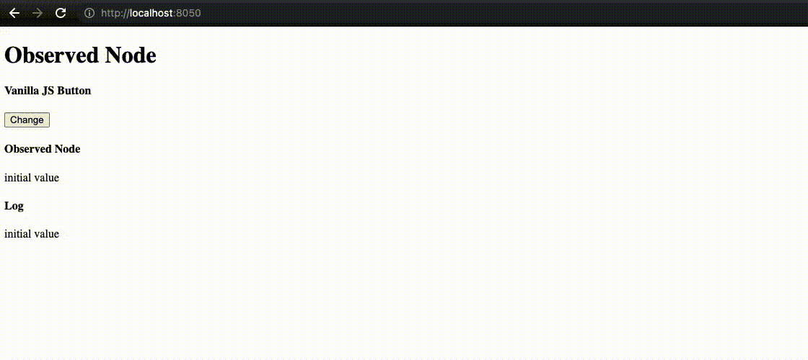

# Dash Observable Node

This repo contains a Dash component that uses a [`MutationObserver`][MutationObserver Mozilla docs]
to monitor its DOM subtree, and fire up Dash callbacks when a change is detected.

### Show, don't Tell




### Run the Demo

  1.  Clone this repo
  2.  setup & activate a venv
  3.  `pip install`
  4.  `python usage.py`

### Add to an Existing App

  1.  Install from GitHub
       * poetry:    
         `poetry add git+https://github.com/cognitedata/dash-observable-node.git@latest`
       * pip:  
         `pip install git+https://github.com/cognitedata/dash-observable-node.git@latest`
  2.  Add to layout:
       * `from dash_observable_node import ObservableNode`
       * somewhere in the layout, not really relevant where (the component is hidden by
         default):
         ``` python
         children=[..., ObservableNode(id="my_observed_node")]
         ...
         ```
  3.  Make a callback:
      ``` python
      @app.callback(
          Output("some_component", "something"),
          Input("my_observed_node", "children"),
      )
      def observed_node_updated(observed_children):
          logger.info("ObservableNode triggered!")
          ...
      ```
  4.  Trigger from vanilla JS:
      ``` javascript
      function someVanillaJSFunc() {
          ...
          document.getElementById('my_observed_node').innerHTML = "some value for the Dash callback";
      }
      ```


## Motivation

Normally, a Dash component will fire its callbacks only in two situations:
 1. when another Dash callback changes some component's state (via `Output`), or
 2. triggered directly by a user interaction on the component (via `Input`).
 3. (I said "two", I know) there are two additional triggers that are not interesting:
    when adding a component into the layout and at the start of the app, see Dash docs:
    [When are callbacks executed][Dash advanced callbacks docs].

While this is a good design for Dash-centered app development, it is sometimes too limiting.

For example, you might have a 3rd party JS widget that displays some information, If you 
need to run a Dash callback whenever the widget turns red (for example), there is no
easy way of doing this. There are two possibilities:

  1.  Use the [`Interval`][Dash Interval component docs] component to check the DOM periodically.
      - This is inefficient and also has other downsides such as interrupting the UI while 
        the `Interval` callback runs (e.g. it will close an open dropdown and also trigger 
        the [`Loading`][Dash Loading component docs] component if present)
  2.  Wrap the 3rd party widget in a custom Dash component.
      - Perfectly doable but also probably an overkill and will often just not happen in real 
        life (lot of work for something that should be a few lines of code, and also requires 
        React.js knowledge). 
      - See docs for [building a custom Dash component][official guide for custom components]  


### Specific Motivation

This component was developed to enable drag&drop ordering of rows in a `DataTable`. 
DataTable component [does not support this feature][dnd not supported] yet. There are many JS drag&drop libraries
(e.g. [`Sortable`][jQueryUI Sortable docs] widget from jQueryUI) which handle the details of the actual UI
interaction (e.g. keeping track of mouse drag, move, drop, positioning the dragged DOM element during the move, etc). 
However, Dash makes it difficult to use such solutions in a Dash app.

With `ObservableNode` we can use such libraries by creating a vanilla JS callback in which the  library to updates
a hidden DOM element with details of a completed drag&drop operation (i.e. initial and final index of the 
dragged&dropped row). `ObservableNode` can then be used to pick up on this update and rearrange the `DataTable` rows
accordingly, using a standard Dash callback.


## Downsides

There are probably good reasons that something like `ObservableNode` is not shipped with Dash. 
One such reason is *circular callbacks*!

### Circular Callbacks

When using regular Dash callbacks, the developer is protected from making a circular chain of
callbacks. Executing such a circular chain would very easily (though not necessarily) result in
an infinite loop which would in turn immediately and significantly increase the thermal output of 
the user's PC. This is bad, unless it's very cold outside and the PC is the only available source of heating. 

With `ObservableNode` it becomes possible to create a circular callback chain!

It is, however, by no means automatically dangerous if used reasonably. One good way to avoid
this issue is to only store minimal required DOM subtree inside the `ObservableNode` component.
This means it is OK to use it as a hidden store for some data that is generated by a 3dr party 
JS function. It is probably NOT OK to wrap an entire `DataTable` with it. 


## State of the Repo

This component has **not** been thoroughly tested! Please consider it an "**alpha**" stage project.

The component seems to work well for its original intention, though.

Needs some testing when using with an actual DOM subtree (more than just a single text node). 
Also needs some unit tests and manual tests with different browsers.

The component is expected to work with the latest versions of all modern browsers.

There should be no issues with Python versions either, but it was tested only on Python 3.8.


-----

[MutationObserver Mozilla docs]: https://developer.mozilla.org/en-US/docs/Web/API/MutationObserver
[Dash advanced callbacks docs]: https://dash.plotly.com/advanced-callbacks#when-are-callbacks-executed?
[Dash Interval component docs]: https://dash.plotly.com/dash-core-components/interval
[Dash Loading component docs]: https://dash.plotly.com/dash-core-components/loading
[official guide for custom components]: https://dash.plotly.com/plugins
[dnd not supported]: https://community.plotly.com/t/interactively-reordering-datatable-columns/33473
[jQueryUI Sortable docs]: https://jqueryui.com/sortable/


_Everything below here was auto-generated at the start of the repo (by cookiecutter). 
It is useful, but to be taken with a grain of salt._


Dash Observable Node is a Dash component library.

Get started with:
1. Install Dash and its dependencies: https://dash.plotly.com/installation
2. Run `python usage.py`
3. Visit http://localhost:8050 in your web browser

## Contributing

See [CONTRIBUTING.md](./CONTRIBUTING.md)

### Install dependencies

If you have selected install_dependencies during the prompt, you can skip this part.

1. Install npm packages
    ```
    $ npm install
    ```
2. Create a virtual env and activate.
    ```
    $ virtualenv venv
    $ . venv/bin/activate
    ```
    _Note: venv\Scripts\activate for windows_

3. Install python packages required to build components.
    ```
    $ pip install -r requirements.txt
    ```
4. Install the python packages for testing (optional)
    ```
    $ pip install -r tests/requirements.txt
    ```

### Write your component code in `src/lib/components/ObservableNode.react.js`.

- The demo app is in `src/demo` and you will import your example component code into your demo app.
- Test your code in a Python environment:
    1. Build your code
        ```
        $ npm run build
        ```
    2. Run and modify the `usage.py` sample dash app:
        ```
        $ python usage.py
        ```
- Write tests for your component.
    - A sample test is available in `tests/test_usage.py`, it will load `usage.py` and you can then automate interactions with selenium.
    - Run the tests with `$ pytest tests`.
    - The Dash team uses these types of integration tests extensively. Browse the Dash component code on GitHub for more examples of testing (e.g. https://github.com/plotly/dash-core-components)
- Add custom styles to your component by putting your custom CSS files into your distribution folder (`dash_observable_node`).
    - Make sure that they are referenced in `MANIFEST.in` so that they get properly included when you're ready to publish your component.
    - Make sure the stylesheets are added to the `_css_dist` dict in `dash_observable_node/__init__.py` so dash will serve them automatically when the component suite is requested.
- [Review your code](./review_checklist.md)

### Create a production build and publish:

1. Build your code:
    ```
    $ npm run build
    ```
2. Create a Python distribution
    ```
    $ python setup.py sdist bdist_wheel
    ```
    This will create source and wheel distribution in the generated the `dist/` folder.
    See [PyPA](https://packaging.python.org/guides/distributing-packages-using-setuptools/#packaging-your-project)
    for more information.

3. Test your tarball by copying it into a new environment and installing it locally:
    ```
    $ pip install dash_observable_node-0.0.1.tar.gz
    ```

4. If it works, then you can publish the component to NPM and PyPI:
    1. Publish on PyPI
        ```
        $ twine upload dist/*
        ```
    2. Cleanup the dist folder (optional)
        ```
        $ rm -rf dist
        ```
    3. Publish on NPM (Optional if chosen False in `publish_on_npm`)
        ```
        $ npm publish
        ```
        _Publishing your component to NPM will make the JavaScript bundles available on the unpkg CDN. By default, Dash serves the component library's CSS and JS locally, but if you choose to publish the package to NPM you can set `serve_locally` to `False` and you may see faster load times._

5. Share your component with the community! https://community.plotly.com/c/dash
    1. Publish this repository to GitHub
    2. Tag your GitHub repository with the plotly-dash tag so that it appears here: https://github.com/topics/plotly-dash
    3. Create a post in the Dash community forum: https://community.plotly.com/c/dash
